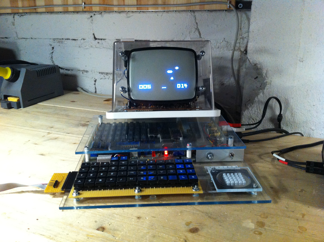

# CHIP-8 Hakkında

CHIP-8 1970'lerin sonunda 1980'lerin başında kendi kendine yap (DIY)
bilgisayar sistemleri için kullanılmış, basit, yorumlanan bir programlama
dilidir. The COSMAC VIP, DREAM 6800 ve ETI 660 bu bilgisayarlar için birer
örnektir.



*Telmac 1800, CHIP-8 oyunu Space Intercept çalıştırıyor.*

Bu sayfanın geri kalanı referans niteliğindedir ve ihtiyaç duyulduğunda
geri dönüp tekrar bakılmak üzere hazırlanmıştır. İsterseniz bu sayfayı
okumayı geçebilirsiniz, yine de bir göz gezdirmenizde fayda var.


## CHIP-8 Özellikleri

### 1. Bellek

CHIP-8 dili `0x000`'dan `0xFFF`'e kadar 4KB (4096 byte) RAM'e ulaşabilir.
İlk 512 byte (`0x000`-`0x1FF`) yorumlayıcının bulunduğu alandır ve hiç bir
program bu alanı kullanmamalıdır.

Çoğu CHIP-8 programı `0x200` alanından başlar. ETI-660 için olan bazı
programlar `0x600`'den başlar fakat bu bir istisna olduğundan görmezden
geleceğiz.

Bellek haritası:

```plain
+---------------+= 0xFFF (4095) CHIP-8 RAM'inin sonu
|               |
|               |
|               |
|               |
| 0x200 - 0xFFF |
|    CHIP-8     |
|  Program ve   |
|  Veri Alanı   |
|               |
|               |
|               |
+---------------+= 0x200 (512) CHIP-8 programlarının başlangıcı
| 0x000 - 0x1FF |
|  Yorumlayıcı  |
| için ayrılmış |
|     alan      |
+---------------+= 0x000 (0) CHIP-8 RAM'inin başlangıcı
```

### 2. Registerlar (Yazmaçlar)

CHIP-8 8-bit boyutunda 16 tane genel kullanımlı register'a sahiptir. Bu
registerlar genelde V*x* olarak adlandırılır (*x*: 0 dan F'e olmak suretiyle
16 lık bir sayıdır). Bir tane de 16-bitlik *I* isimli register vardır. Bu
register genelde bellek adresini tutmaya yarar ve bu nedenle I registerinin
sadece en düşük, (sağdan) 12 biti kullanılır.

*VF* registeri hic bir program tarafından kullanılmamalıdır ve bu register
bazı instructionların flag değerini saklamak için kullanılır.

CHIP-8 ayrıca, gecikme ve ses zamanlaması için, iki 8-bit uzunluğunda özel
kullanımlı register'a sahiptir. Bu registerlar sıfır olmadığı zaman, 60 Hz
oranında düşürülür.

Çalışmakta olan adresi tutan; 16-bit boyutunda program sayacı (*PC*:
program counter) ve stack'in en üst adresini tutan; 8-bit uzunluğunda stack
pointer (*SP*) sözde-registerları da vadır. Bu registerlara hiç bir program
ulaşamaz.

Stack 16 tane 16-bitlik değerden oluşur.


### 3. Klavye

CHIP-8 dilinin kullanıldığı bilgisayarlar aşagıdaki şemadaki gibi 16 tuşlu
klavyeye sahiptir:

```plain
+---+---+---+---+
| 1 | 2 | 3 | C |
| 4 | 5 | 6 | D |
| 7 | 8 | 9 | E |
| A | 0 | B | F |
+---+---+---+---+
```

Bu klavyenin modern bilgisayarlarda çalışabilmesi için tekrar haritalanması
gerekmektedir.

### 4. Görüntü

CHIP-8 dili 64x32 boyutunda, aşağıdaki formata sahip siyah beyaz bir ekrana
sahiptir:

```plain
+-------------------+
| (0,0)      (63,0) |
| (0,31)    (63,31) |
+-------------------+
```

Programlar 0'dan F'e kadar olmak üzere CHIP-8 belleği üzerinde yer alan
spriteları da gösterebilir.

### 5. Zamanlayıcılar ve Ses

CHIP-8'de 2 tane zamanlayıcı bulunmaktadır: Gecikme ve ses zamanlayıcıları.

Gecikme zamanlayıcısı 0 olmadığı süre boyunca aktiftir ve her 60Hz yenileme
sürecinden sonra bir azaltılır.

Ses zamanlayıcısı da aynı gecikme zamanlayıcısı gibi çalışır. Tek fark
aktif olduğu süre boyunca CHIP-8 zili öter.


## Ayrıntılı Bilgi

CHIP-8 hakkında daha fazla bilgi almak için:
[Cowgod'un Chip-8 Teknik Referans'ı](http://devernay.free.fr/hacks/chip8/C8TECH10.HTM)
sayfasına göz atabilirsiniz.
